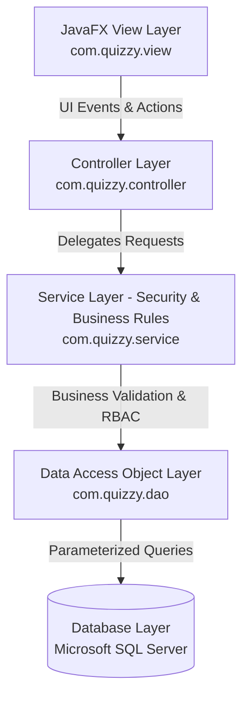

<div align="center">

# 🎯 Quizzy - Enterprise Desktop Quiz & Learning Platform

> A modern, high-performance JavaFX desktop application for interactive quiz management and online testing, built with **Java 21**, **Pure Java UI (No FXML)**, **Microsoft SQL Server**, **JDBC**, **BCrypt Security**, and a decoupled **5-Tier Architecture (View - Controller - Service - DAO - Model)**.


</div>

---

## 📑 Table of Contents

- [Overview](#-overview)
- [System Architecture & Design Patterns](#-system-architecture--design-patterns)
- [Key Features](#-key-features)
- [Authentication & Security Standards](#-authentication--security-standards)
- [Tech Stack](#-tech-stack)
- [Project Directory Structure](#-project-directory-structure)
- [Database Schema Architecture](#-database-schema-architecture)
- [Getting Started](#-getting-started)
  - [Prerequisites](#prerequisites)
  - [Configuration](#configuration)
  - [Build & Run Commands](#build--run-commands)
- [Application Workflow](#-application-workflow)
- [Security & Data Integrity](#-security--data-integrity)
- [License](#-license)

---

## 📖 Overview

**Quizzy** is an enterprise-grade desktop quiz and assessment platform designed for educational institutions, corporate training programs, and individual learners. The application provides two distinct operational suites:

1. **Administrative Management Suite**: Comprehensive administration of knowledge topics, quiz configurations, question bank items with difficulty ratings, answer key distributions, user role management, and system-wide performance audit logs.
2. **Interactive Player Platform**: Modern public portal, self-registration with strong password enforcement, real-time topic & quiz search, timed assessment engine with countdown timers, automatic server-side score calculation, and interactive test attempt review.

Quizzy strictly follows **Pure JavaFX UI Construction (Zero FXML / FXMLLoader)**, eliminating XML parsing overhead, providing 100% compile-time type safety, modular component encapsulation, and modern desktop UI styling with JavaFX CSS.

---

## 🏗️ System Architecture & Design Patterns

Quizzy implements a robust **5-Tier Decoupled Architecture**:



### Design Patterns Applied:
- **MVC (Model-View-Controller)**: Strict separation between UI construction (`View`), user event orchestration (`Controller`), and domain models (`Model`).
- **DAO (Data Access Object) Pattern**: Full abstraction of persistence logic behind interfaces with reusable mapper utilities (DRY).
- **Service Layer Pattern**: Centralized business rule validation, automated scoring algorithms, and RBAC authorization guards.
- **Factory Pattern**: Centralized factory instantiation via `ServiceFactory` and `DAOFactory`.
- **Singleton / Static Manager Pattern**: Global stage navigation (`SceneManager`) and thread-safe user session management (`SessionManager`).

---

## ✨ Key Features

### 🌐 1. Landing & Navigation Portal (`HomeView`, `HomeController`)
- Modern branding with dynamic system statistics.
- Direct role-based routing between Public, Player, and Admin zones.

### 🔐 2. Authentication & Registration (`LoginView`, `RegisterView`, `AuthService`)
- Self-service registration with real-time field validation.
- Strict password complexity enforcement via Regex policy.
- Secure credential protection using **BCrypt ($2a$12$)** cryptographic hashing.
- Role-based automatic redirection on successful authentication.

### 📁 3. Knowledge Topic Management (`TopicView`, `TopicController`)
- Administrative management for subject categories.
- Real-time search, sorting, and deletion safety checks against active quizzes.

### 📝 4. Quiz Assessment Configuration (`QuizView`, `QuizController`)
- Customizable question counts, target topic associations, and time limits (minutes).
- Multi-criteria filtering by topic, keyword, and creation timeline.

### ❓ 5. Question & Answer Bank (`QuestionView`, `AnswerView`, `QuestionFormDialog`)
- Question bank management with difficulty badges (`Easy`, `Medium`, `Hard`).
- Unified modal dialog for managing questions and 4 multiple-choice options (A, B, C, D) simultaneously.
- Standalone answer inspection view for auditing distractors and key correctness.

### 👥 6. User Management (`UserView`, `UserController`)
- Administrative overview of registered users with role tags (`Admin` / `Player`).
- Secure administrative account creation and profile updates.

### 🎯 7. Player Dashboard & Exam Engine (`PlayerDashboardView`, `SelectQuizView`, `TakeQuizView`)
- Real-time search bar for learning topics and quizzes.
- Timed examination canvas with real-time countdown timer alerts.
- Question navigation stepper and confirmation modal prior to submission.
- Server-side score evaluation with `RoundingMode.HALF_UP` precision.

### 📊 8. Performance Analytics & History Review (`QuizHistoryView`, `ResultView`, `HistoryDetailView`)
- Detailed test attempt history with metric badges (Score %, Correct/Incorrect ratio, Time taken).
- Interactive question-by-question review with answer explanations and status indicators.
- Administrator overview for reviewing attempts across all registered candidates.

---

## 🔐 Authentication & Security Standards

Quizzy enforces **Role-Based Access Control (RBAC)** across application layers:

| Role | Permitted Actions | Security Layer Enforcement |
|---|---|---|
| **ADMIN** | Full administrative suite: Topic CRUD, Quiz CRUD, Question CRUD, Answer CRUD, User Management, Global Result Analytics. | Guarded by `SessionManager.requireAdmin()` on all service mutations and `SceneManager` route checks. |
| **PLAYER** | Public Portal, Registration, Login, Topic & Quiz Exploration, Timed Exam Execution, Personal Test History Review. | Administrative routes blocked; data queries strictly scoped to `WHERE UserID = session.userId`. |

### Password Security Policy:
- Minimum 8 characters.
- Must contain at least one uppercase letter `[A-Z]`, one lowercase letter `[a-z]`, one numeric digit `[0-9]`, and one special symbol `[@$!%*?&]`.
- Passwords are salted and hashed with **BCrypt ($2a$12$)** before persisting to database storage.
- Includes transparent auto-migration on login for legacy plaintext accounts (see [MIGRATION.md](file:///d:/LearningProgramming/projects/Quizzy/MIGRATION.md)).

---

## 🛠️ Tech Stack

| Component | Technology | Description |
|---|---|---|
| **Language** | Java | JDK 21 (LTS) |
| **GUI Framework** | OpenJFX (JavaFX) | 21.0.2 (Pure Java UI Code, 0 FXML) |
| **Database** | Microsoft SQL Server | Relational Data Storage |
| **Database Driver** | JDBC Driver | `mssql-jdbc:13.4.0.jre11` |
| **Security & Hashing** | jBCrypt | `org.mindrot:jbcrypt:0.4` |
| **Build & Tooling** | Apache Maven | 3.x (`javafx-maven-plugin:0.0.8`) |
| **Styling** | JavaFX CSS | Theme (`style.css`) |

---

## 📂 Project Directory Structure

```text
Quizzy/
├── pom.xml                                      # Maven Dependencies & Build Configuration
├── MIGRATION.md                                 # Password Hashing Migration Guide
├── README.md                                    # Project Documentation
└── src/
    └── main/
        ├── java/com/quizzy/
        │   ├── Main.java                        # JavaFX Application Entry Point
        │   ├── controller/                      # Controller Orchestration Layer
        │   │   ├── AdminDashboardController.java
        │   │   ├── AdminResultController.java
        │   │   ├── AnswerController.java
        │   │   ├── HistoryDetailController.java
        │   │   ├── HomeController.java
        │   │   ├── LoginController.java
        │   │   ├── MainController.java
        │   │   ├── PlayerDashboardController.java
        │   │   ├── QuestionController.java
        │   │   ├── QuizController.java
        │   │   ├── QuizHistoryController.java
        │   │   ├── RegisterController.java
        │   │   ├── ResultController.java
        │   │   ├── SelectQuizController.java
        │   │   ├── TakeQuizController.java
        │   │   ├── TopicController.java
        │   │   └── UserController.java
        │   ├── dao/                             # Data Access Layer & Implementations
        │   │   ├── AnswerDAO.java / AnswerDAOImpl.java
        │   │   ├── QuestionDAO.java / QuestionDAOImpl.java
        │   │   ├── QuizDAO.java / QuizDAOImpl.java
        │   │   ├── ResultDAO.java / ResultDAOImpl.java
        │   │   ├── ResultDetailDAO.java / ResultDetailDAOImpl.java
        │   │   ├── TopicDAO.java / TopicDAOImpl.java
        │   │   └── UserDAO.java / UserDAOImpl.java
        │   ├── factory/                         # Factory Layer
        │   │   ├── DAOFactory.java
        │   │   └── ServiceFactory.java
        │   ├── model/                           # Domain Entity Models
        │   │   ├── Answer.java
        │   │   ├── Question.java
        │   │   ├── Quiz.java
        │   │   ├── Result.java
        │   │   ├── ResultDetail.java
        │   │   ├── Topic.java
        │   │   └── User.java
        │   ├── service/                         # Business Logic & RBAC Security Layer
        │   │   ├── AnswerService.java
        │   │   ├── AuthService.java
        │   │   ├── QuestionService.java
        │   │   ├── QuizService.java
        │   │   ├── ResultDetailService.java
        │   │   ├── ResultService.java
        │   │   ├── TopicService.java
        │   │   └── UserService.java
        │   ├── util/                            # Security & Core Utilities
        │   │   ├── DatabaseConnection.java
        │   │   ├── NavIconHelper.java
        │   │   ├── PasswordHasher.java
        │   │   ├── SceneManager.java
        │   │   └── SessionManager.java
        │   └── view/                            # Pure JavaFX UI View Classes
        │       ├── AdminDashboardView.java
        │       ├── AdminResultView.java
        │       ├── AnswerView.java
        │       ├── HistoryDetailView.java
        │       ├── HomeView.java
        │       ├── LoginView.java
        │       ├── MainView.java
        │       ├── PlayerDashboardView.java
        │       ├── QuestionView.java
        │       ├── QuizHistoryView.java
        │       ├── QuizView.java
        │       ├── RegisterView.java
        │       ├── ResultView.java
        │       ├── SelectQuizView.java
        │       ├── TakeQuizView.java
        │       ├── TopicView.java
        │       ├── UserView.java
        │       └── component/                   # Reusable UI Dialogs & Widgets
        │           ├── AdminSidebar.java
        │           ├── ConfirmDialog.java
        │           ├── PasswordInputField.java
        │           ├── QuestionFormDialog.java
        │           ├── QuizFormDialog.java
        │           ├── StatCard.java
        │           ├── StatusBadge.java
        │           ├── SubmitQuizModal.java
        │           ├── TopicFormDialog.java
        │           ├── UserFormDialog.java
        │           └── UserProfileWidget.java
        └── resources/com/quizzy/
            ├── css/
            │   └── style.css                    # Unified Application Stylesheet
            └── images/                          # UI Vector/Raster Assets
                ├── hero.png
                ├── quizzy-icon.png
                ├── quizzy-logo.png
                └── user-avatar.png
```

---

## 🗄️ Database Schema Architecture

The relational database model comprises core business entities:

- **`Users`**: User identities, role privileges (`Admin` / `Player`), and salted BCrypt password hashes.
- **`Topic`**: Knowledge domains and subject categories.
- **`Quiz`**: Assessment definitions, associated topic relationships, question count thresholds, and time limits.
- **`Question`**: Assessment questions categorized by difficulty level (`Easy`, `Medium`, `Hard`).
- **`Answer`**: Multiple-choice options linked to parent questions with correctness flags.
- **`Result`**: Candidate assessment logs including total score, accuracy ratio, start timestamp, and finish timestamp.
- **`ResultDetail`**: Granular question-by-question attempt records tracking user chosen answers and correctness.

---

## 🚀 Getting Started

### Prerequisites
- **Java Development Kit (JDK)**: Version 21 (LTS) or higher.
- **Apache Maven**: Version 3.8+ configured in system `PATH`.
- **Microsoft SQL Server**: 2017+ instance reachable over TCP/IP (default port `1433`).

### Configuration
Configure database connectivity parameters via system environment variables or local properties in [`DatabaseConnection.java`](file:///d:/LearningProgramming/projects/Quizzy/src/main/java/com/quizzy/util/DatabaseConnection.java):

```java
// Example configuration template
public class DatabaseConnection {
    public static final String URL = "jdbc:sqlserver://${DB_HOST}:${DB_PORT};"
            + "databaseName=${DB_NAME};"
            + "encrypt=true;"
            + "trustServerCertificate=true";
    public static final String USERNAME = "${DB_USER}";
    public static final String PASSWORD = "${DB_PASSWORD}";
}
```

### Build & Run Commands

```bash
# 1. Clone repository
git clone https://github.com/alvareztran/quizzy.git
cd quizzy

# 2. Build and verify compilation
mvn clean test-compile

# 3. Launch application
mvn javafx:run
```

---

## 🔄 Application Workflow

```text
                      [ Home Landing Page ]
                                │
                ┌───────────────┴───────────────┐
                ▼                               ▼
        [ Login Screen ] ◄─────────────── [ Register Screen ]
                │
        ┌───────┴───────────────────────────────┐
        ▼                                       ▼
  (Admin Role)                            (Player Role)
[ Admin Dashboard ]                     [ Player Dashboard ]
   ├── Topic Management                    └── [ Choose Topic & Quiz ] (Live Search)
   ├── Quiz Management                                └── [ Take Timed Exam ]
   ├── Question Bank                                         └── [ View Results & Review ]
   ├── Answer Bank
   ├── User Management
   └── Result Audit Logs
```

---

## 🛡️ Security & Data Integrity

- **SQL Injection Defense**: 100% of queries use parameterized `PreparedStatement` instances; dynamic SQL string concatenation is strictly prohibited.
- **Resource Management**: All JDBC connections, prepared statements, and result sets are managed via `try-with-resources` blocks to guarantee immediate connection release.
- **Cryptographic Security**: Passwords are saved as one-way cryptographic hashes using BCrypt with configurable work factor ($2a$12$).
- **Data Isolation**: Multi-tenant data segregation guarantees players can only query their own test history.

---

## 📜 License

This project is licensed under the [MIT License](LICENSE).
