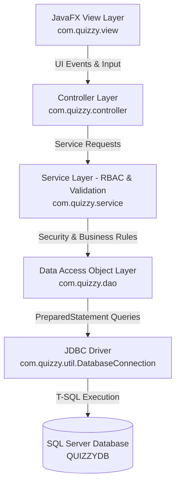

<div align="center">

# 🎯 Quizzy - Enterprise Desktop Quiz & Learning Platform

> A modern, high-performance JavaFX desktop application for interactive quiz management and online testing, built with **Java 21**, **Pure Java UI (No FXML)**, **SQL Server**, **JDBC**, and a decoupled **5-Tier Architecture (View - Controller - Service - DAO - Model)**.


</div>

---

## 📑 Table of Contents

- [Overview](#-overview)
- [System Architecture & Design Patterns](#-system-architecture--design-patterns)
- [Key Features & Module Audit](#-key-features--module-audit)
- [Authentication & Role-Based Access Control (RBAC)](#-authentication--role-based-access-control-rbac)
- [Tech Stack](#-tech-stack)
- [Project Directory Structure](#-project-directory-structure)
- [Database Overview](#-database-overview)
- [Getting Started](#-getting-started)
  - [Prerequisites](#prerequisites)
  - [Database Setup](#database-setup)
  - [Configuration](#configuration)
  - [Build & Run Commands](#build--run-commands)
- [Application Workflow](#-application-workflow)
- [Security Audit & Data Integrity](#-security-audit--data-integrity)
- [License](#-license)

---

## 📖 Overview

**Quizzy** is an enterprise-grade desktop quiz platform designed for educational institutions, corporate training programs, and individual learners. It delivers two tailored experiences:
1. **Administrative Suite**: Comprehensive management of topics, quizzes, questions, answer keys, user accounts, and system-wide results.
2. **Player Experience**: Interactive public landing page, self-registration, topic/quiz selection, timed test environment, real-time score calculation, and personal test history.

Quizzy strictly adheres to **Pure JavaFX Code Development (Zero FXML / FXMLLoader)**, eliminating XML parsing overhead while providing 100% type-safe GUI construction, modular component reuse, and an enterprise BigTech UI design system styled with JavaFX CSS.

---

## 🏗️ System Architecture & Design Patterns

Quizzy strictly enforces a **5-Tier Decoupled Architecture**:



### Design Patterns Implemented:
- **MVC (Model-View-Controller)**: Complete separation between JavaFX UI layouts (`View`), user event handlers & navigation (`Controller`), and entity structures (`Model`).
- **DAO (Data Access Object) Pattern**: Abstracts data persistence behind Java interfaces (`TopicDAO`, `QuizDAO`, `QuestionDAO`, `AnswerDAO`, `UserDAO`, `ResultDAO`).
- **Service Layer Pattern**: Contains all business logic, score calculations, duplicate assertions, and security assertions (`SessionManager.requireAdmin()`).
- **Factory Pattern**: Centralized object instantiation via `ServiceFactory` and `DAOFactory`.
- **Singleton / Static Manager Pattern**: Centralized session state management (`SessionManager`) and stage routing (`SceneManager`).

---

## ✨ Key Features & Module Audit

### 🌐 1. Public Landing Page & Branding (`HomeView`)
- **Compact Navbar**: Prominent Quizzy logo & brand title with ghost `Login` and gradient primary `Register` buttons.
- **2-Column Hero Banner**: Gradient typography (*"Test your knowledge. Learn. Practice. **Improve.**"*), eyebrow badge, dual CTAs, and an abstract interactive Quiz UI mockup card composition.
- **Live Real-time Metrics**: Live SQL Server metrics badge (`⚡ X Topics • Y Quizzes • Z Questions`) dynamically queried from database services.
- **"WHY QUIZZY" Section**: Horizontal feature cards detailing Smart Practice, Performance Analytics, and Targeted Growth.

### 🔐 2. Authentication & User Registration (`LoginView`, `RegisterView`)
- **Two-Way Navigation**: Seamless navigation between Home, Login, and Register screens with explicit *"← Back to Home"* buttons and clickable logo headers.
- **Self-Registration**: Full Name, Username, Password, and Confirm Password validation.
- **Role Security**: Role selection is strictly hidden on UI. Role is hardcoded to `"Player"` inside `AuthService`.
- **Multi-layer Validation**: Frontend empty & mismatch checks + Service-level duplicate username checks (`"Username already exists."`).

### 📁 3. Topic Bank Management (`TopicView`, `TopicService`, `TopicDAO`)
- Admin CRUD for quiz categories.
- Real-time search by topic name, status filtering, and sorting.
- Deletion safeguards preventing deletion of topics with associated quizzes.
- Table layout optimized with left-aligned data columns (`#`, `TOPIC NAME`, `DESCRIPTION`) and centered `ACTIONS`.

### 📝 4. Quiz Assessment Management (`QuizView`, `QuizService`, `QuizDAO`)
- Admin CRUD for quiz title, target topic association, question count, and time limit (minutes).
- Topic filter dropdown and search toolbar.
- Safeguards preventing deletion of active quizzes linked to recorded test results.

### ❓ 5. Question & Answer Bank Management (`QuestionView`, `AnswerView`, `QuestionFormDialog`)
- **Question Bank**: Manage question text, target quiz, and difficulty rating badges (`Easy`, `Medium`, `Hard`).
- **Integrated Question Dialog (`QuestionFormDialog`)**: Unified dialog to create/edit a question along with its 4 multiple-choice options (A, B, C, D) and select the correct answer key.
- **Standalone Answer Bank (`AnswerView`)**: Dedicated standalone table to search, filter by correct status (`● Correct` / `○ Incorrect`), and inspect option distractors.

### 👤 6. User Account Management (`UserView`, `UserService`, `UserDAO`)
- Admin user account overview with role badges (`Admin` / `Player`).
- Admin user creation and password/role management.

### 🎯 7. Player Timed Quiz Engine (`SelectQuizView`, `TakeQuizView`)
- **Interactive Quiz Selection**: Topic-filtered quiz cards showing question counts and time limits.
- **Timed Test Environment**: Countdown timer badge, question tracker (`Question X of N`), difficulty tags, and radio answer option cards.
- **Server-Side Scoring**: Computes score (out of 10.0) using `HALF_UP` rounding, calculates correct/wrong answer counts, and persists results to SQL Server.

### 📊 8. Performance Analytics & History (`ResultView`, `ResultService`)
- **Player History**: Isolated view showing only personal quiz test history (`WHERE UserID = session.userId`).
- **Admin System Overview**: Filter and review test results across all registered users and quizzes.

---

## 🔐 Authentication & Role-Based Access Control (RBAC)

Quizzy implements **Service-Layer Enforced RBAC**:

| Role | Permitted Actions | Security Layer Enforcement |
|---|---|---|
| **ADMIN** | Access Admin Dashboard, Topic CRUD, Quiz CRUD, Question CRUD, Answer CRUD, User Management, System-wide Results. | `SessionManager.requireAdmin()` called at entry point of all administrative Service mutation methods; `SceneManager` route guards. |
| **PLAYER** | Public Home, Register, Login, Select Quiz, Take Quiz, Submit Quiz, View Personal Results History, Logout. | Automatically restricted from Admin routes; `ResultService` restricts queries to `WHERE UserID = session.userId`. Client-side role selection blocked. |

---

## 🛠️ Tech Stack

| Component | Technology | Version / Details |
|---|---|---|
| **Language** | Java | JDK 21 (LTS) |
| **GUI Framework** | OpenJFX (JavaFX) | 21.0.2 (Pure Java UI Code, 0 FXML) |
| **Database** | Microsoft SQL Server | Relational Database (`QUIZZYDB`) |
| **Database Connectivity** | JDBC Driver | `com.microsoft.sqlserver:mssql-jdbc:13.4.0.jre11` |
| **Build System** | Apache Maven | 3.x (`javafx-maven-plugin:0.0.8`) |
| **Styling** | JavaFX CSS | Modern Enterprise CSS Theme (`style.css`) |

---

## 📂 Project Directory Structure

```text
Quizzy/
├── pom.xml                                      # Maven Dependencies & Build Configuration
├── README.md                                    # Project Documentation
├── docs/                                        # Architecture Diagrams
│   └── architecture_diagram.png
└── src/
    └── main/
        ├── java/com/quizzy/
        │   ├── Main.java                        # JavaFX Application Entry Point
        │   ├── controller/                      # Controller Event & Orchestration Classes
        │   │   ├── AdminDashboardController.java
        │   │   ├── AnswerController.java
        │   │   ├── HomeController.java
        │   │   ├── LoginController.java
        │   │   ├── MainController.java
        │   │   ├── QuestionController.java
        │   │   ├── QuizController.java
        │   │   ├── RegisterController.java
        │   │   ├── ResultController.java
        │   │   ├── SelectQuizController.java
        │   │   ├── TakeQuizController.java
        │   │   ├── TopicController.java
        │   │   └── UserController.java
        │   ├── dao/                             # Data Access Object Layer & Implementations
        │   │   ├── AnswerDAO.java / AnswerDAOImpl.java
        │   │   ├── QuestionDAO.java / QuestionDAOImpl.java
        │   │   ├── QuizDAO.java / QuizDAOImpl.java
        │   │   ├── ResultDAO.java / ResultDAOImpl.java
        │   │   ├── TopicDAO.java / TopicDAOImpl.java
        │   │   └── UserDAO.java / UserDAOImpl.java
        │   ├── factory/                         # Factory Instantiators
        │   │   ├── DAOFactory.java
        │   │   └── ServiceFactory.java
        │   ├── model/                           # Domain Entity Models
        │   │   ├── Answer.java
        │   │   ├── Question.java
        │   │   ├── Quiz.java
        │   │   ├── Result.java
        │   │   ├── Topic.java
        │   │   └── User.java
        │   ├── service/                         # Service Layer Business Logic & RBAC
        │   │   ├── AnswerService.java
        │   │   ├── AuthService.java
        │   │   ├── QuestionService.java
        │   │   ├── QuizService.java
        │   │   ├── ResultService.java
        │   │   ├── TopicService.java
        │   │   └── UserService.java
        │   ├── util/                            # Core Utilities
        │   │   ├── DatabaseConnection.java
        │   │   ├── SceneManager.java
        │   │   └── SessionManager.java
        │   └── view/                            # Pure JavaFX View Layout Classes
        │       ├── AdminDashboardView.java
        │       ├── AnswerView.java
        │       ├── HomeView.java
        │       ├── LoginView.java
        │       ├── MainView.java
        │       ├── QuestionView.java
        │       ├── QuizView.java
        │       ├── RegisterView.java
        │       ├── ResultView.java
        │       ├── SelectQuizView.java
        │       ├── TakeQuizView.java
        │       ├── TopicView.java
        │       ├── UserView.java
        │       └── component/                   # Reusable UI Widgets
        │           ├── QuestionFormDialog.java
        │           ├── StatCard.java
        │           ├── StatusBadge.java
        │           └── UserProfileWidget.java
        └── resources/com/quizzy/
            ├── css/
            │   └── style.css                    # Unified Application Stylesheet
            └── images/                          # High-Resolution UI Image Assets
                ├── hero.png
                ├── quizzy-icon.png
                ├── quizzy-logo.png
                └── user-avatar.png
```

---

## 🗄️ Database Overview

The relational database **`QUIZZYDB`** contains 6 core entities:
- **`Users`**: User accounts and credentials (`UserID`, `Username`, `Password`, `FullName`, `Role`, `CreatedAt`).
- **`Topic`**: Quiz categories (`TopicID`, `TopicName`, `Description`).
- **`Quiz`**: Quiz configurations (`QuizID`, `TopicID`, `QuizName`, `NumberOfQuestions`, `TimeLimit`, `CreatedAt`).
- **`Question`**: Assessment questions (`QuestionID`, `QuizID`, `Content`, `Difficulty`, `CreatedAt`).
- **`Answer`**: Question multiple-choice options (`AnswerID`, `QuestionID`, `AnswerContent`, `IsCorrect`).
- **`Result`**: User test performance history (`ResultID`, `UserID`, `QuizID`, `Score`, `TotalQuestions`, `CorrectAnswers`, `StartedAt`, `FinishedAt`).

---

## 🚀 Getting Started

### Prerequisites
- **Java Development Kit (JDK)**: Version 21 (LTS) or higher.
- **Apache Maven**: Version 3.8+ added to system `PATH`.
- **Microsoft SQL Server**: 2017+ with TCP/IP enabled on port `1433`.

### Database Setup
1. Create a database named **`QUIZZYDB`** in Microsoft SQL Server with the required tables (`Users`, `Topic`, `Quiz`, `Question`, `Answer`, `Result`).
2. Seed an initial administrator account (`Role = 'Admin'`) to access management features.

### Configuration
Update connection settings in [`DatabaseConnection.java`](file:///d:/LearningProgramming/projects/Quizzy/src/main/java/com/quizzy/util/DatabaseConnection.java):
```java
public class DatabaseConnection {
    public static final String URL = "jdbc:sqlserver://localhost:1433;"
            + "databaseName=QUIZZYDB;"
            + "encrypt=true;"
            + "trustServerCertificate=true";
    public static final String USERNAME = "YOUR_DB_USERNAME";
    public static final String PASSWORD = "YOUR_DB_PASSWORD";
}
```

### Build & Run Commands

```bash
# 1. Clone Repository
git clone https://github.com/alvareztran/quizzy.git
cd quizzy

# 2. Clean and Compile
mvn clean compile

# 3. Launch Application via OpenJFX Plugin
mvn javafx:run
```

---

## 🔄 Application Workflow

```text
                     [ Home Landing Page ]
                               │
               ┌───────────────┴───────────────┐
               ▼                               ▼
       [ Login Screen ] ◄─────────────── [ Register Screen ]
               │
       ┌───────┴───────────────────────────────┐
       ▼                                       ▼
 (Admin Role)                           (Player Role)
[ Admin Dashboard ]                    [ Select Quiz ]
   ├── Topic Management                   └── [ Take Quiz ]
   ├── Quiz Management                           └── [ View Personal Results ]
   ├── Question Management
   ├── Answer Management
   ├── User Management
   └── System-wide Results
```

---

## 🛡️ Security Audit & Data Integrity

- **SQL Injection Prevention**: 100% of database interactions in DAO implementation classes use parameterized `PreparedStatement` instances. String concatenation for SQL queries is strictly prohibited.
- **Resource Management**: All JDBC connections, statements, and result sets use Java `try-with-resources` blocks to prevent connection leaks.
- **RBAC Security**: Service-layer assertion (`SessionManager.requireAdmin()`) prevents unauthorized code execution regardless of UI state.
- **Data Isolation**: Players can only view their own test history. Database queries filter by `UserID = session.userId`.

---

## 📜 License

This project is licensed under the [MIT License](LICENSE).
